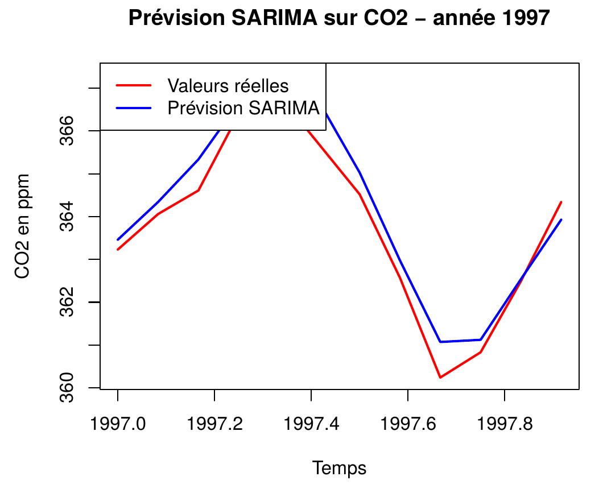
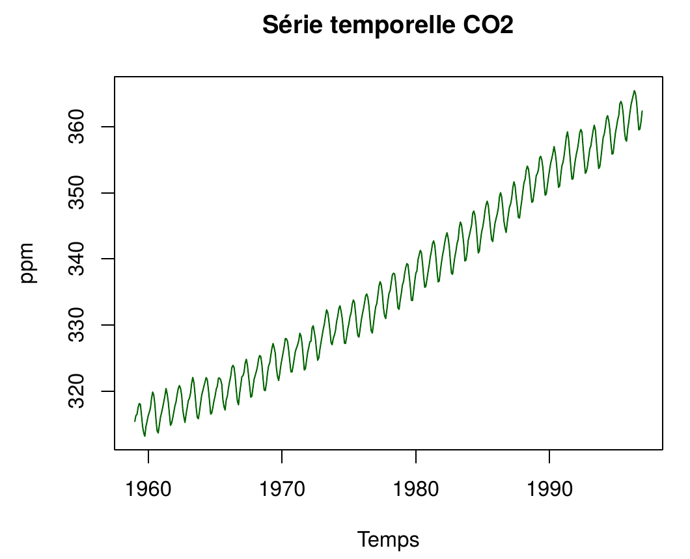

# Prévision de la concentration de CO₂ atmosphérique

**Peut-on prévoir l'évolution mensuelle du CO₂ dans l'atmosphère un an à l'avance ?**

Projet de séries temporelles réalisé en R à Polytech Lyon : comparaison de modèles de régression (tendance + saisonnalité de Fourier) et de modèles SARIMA pour prévoir l'année 1997.



## En bref

- Analyse d'une série mensuelle de concentration de CO₂ (1959 – 1997) : tendance, saisonnalité, stationnarité
- **Régression** avec tendance et saisonnalité : effets mensuels ou **termes de Fourier** (sinus et cosinus de période 12 et 6 mois)
- **SARIMA** : transformation logarithmique, différenciations ordinaire et saisonnière, test ADF, sélection par AIC, diagnostic des résidus (Ljung-Box)
- Évaluation honnête : modèles ajustés jusqu'en 1996, **prévision de l'année 1997** jamais vue

**Résultat principal :** le SARIMA prévoit 1997 avec une erreur moyenne d'environ **0,5 ppm** (RMSE), contre environ **2,1 ppm** pour les meilleurs modèles de régression, soit une erreur **4 fois plus faible**.

## Données

Série `co2` fournie avec R (`data(co2)`) : concentration atmosphérique mensuelle de CO₂, en ppm, mesurée à l'observatoire de Mauna Loa (Hawaï) de 1959 à 1997.



La série présente une **tendance croissante** nette et une **saisonnalité annuelle** marquée : elle n'est pas stationnaire.

- **Apprentissage :** 1959 – 1996
- **Test :** les 12 mois de 1997, mis de côté pour évaluer les prévisions

## Méthode

### 1. Modèles de régression

| Modèle | Spécification | AIC |
|---|---|---|
| 1 | Tendance linéaire seule | 2172 |
| 2 | Tendance + effet de chaque mois | 1752 |
| 3 | Tendance + une harmonique (période 12 mois) | 1784 |
| 4 | Tendance + deux harmoniques (12 et 6 mois) | **1739** |

La tendance seule explique déjà 97 % de la variance mais ignore les oscillations saisonnières. Les termes de Fourier reproduisent la saisonnalité avec peu de paramètres : le modèle 4 obtient le meilleur AIC avec 7 paramètres, contre 14 pour le modèle à effets mensuels.

### 2. Modèles SARIMA

- **Transformation logarithmique** de la série.
- **Diagnostic de non-stationnarité** : ACF à décroissance lente, test ADF non significatif (p = 0,089).
- **Différenciation ordinaire** pour retirer la tendance, puis **saisonnière** (lag 12) pour retirer la saisonnalité. La série obtenue est stationnaire (test ADF : p < 0,01).
- **Comparaison de modèles SARIMA(p,1,q)(P,1,Q)₁₂** candidats et d'une recherche automatique (`auto.arima`) par AIC.
- **Modèle retenu** : ARIMA(0,1,1)(2,1,2)₁₂.
- **Diagnostic des résidus** : test de Ljung-Box non significatif (p = 0,22), les résidus sont compatibles avec un bruit blanc.

## Résultats

Erreurs de prévision sur l'année 1997 :

| Modèle | RMSE (ppm) | MAPE |
|---|---|---|
| Régression : tendance + effets mensuels | 2,11 | 0,57 % |
| Régression : tendance + 2 harmoniques | 2,12 | 0,57 % |
| **SARIMA(0,1,1)(2,1,2)₁₂** | **0,52** | **0,12 %** |

Les régressions captent bien la forme saisonnière, mais traitent la tendance et la saisonnalité de façon fixe et ignorent la dépendance entre erreurs successives. Le SARIMA modélise cette dépendance, ce qui divise l'erreur de prévision par 4.

**Limite :** le modèle automatique n'a pas strictement le plus petit AIC (SARIMA(1,1,1)(0,1,1)₁₂ est très légèrement meilleur). Les écarts d'AIC entre candidats sont négligeables ; une comparaison complète de tous les candidats sur l'année de test serait l'étape suivante.

## Documents

- [`rapport_co2_series_temporelles.pdf`](rapport_co2_series_temporelles.pdf) : rapport détaillé (démarche, sorties R, diagnostics)
- [`analyse_co2_series_temporelle.pptx.pdf`](analyse_co2_series_temporelle.pptx.pdf) : support de présentation

## Exécution

```r
install.packages(c("forecast", "tseries"))
```

Puis exécuter `co2.R` dans R ou RStudio. Les données sont incluses dans R, aucun téléchargement n'est nécessaire.

## Outils

R · forecast · tseries
